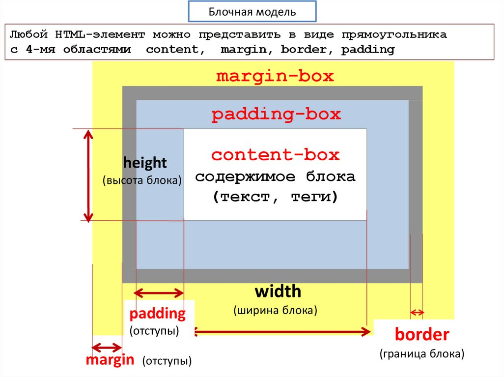

1.  Блочные элементы HTML.

    Исторически HTML-элементы было принято делить на блочные и строчные. 
    Блочные элементы занимают всю ширину своего родителя (контейнера), формально создавая «блок» (отсюда и название). 
    Браузеры обычно отображают блочные элементы с переводом строки до и после элемента. Блочные элементы можно представить в виде стопки коробок. 


        - <div>
        - <p>
        - <ul>
        - <li>
        - <ol>
        - <article>
        - <section>
        - <header>
        - <footer>
        - <form>
        - <main>


2. Cтрочные элементы HTML.

    Cтрочные элементы это те, которые занимают только то пространство, которое ограничено тегами, определяющими строчный элемент (необходимое для отображения их содержимого) и не нарушая потока содержимого (не требующее новой строки после каждого элемента).
    Строчный элемент не начинается с новой строки и в ширину занимает столько места, сколько это необходимо для его отображения.

    Следующие элементы являются строчными:


        - <i>
        - <em>
        - <a>
        - 
        - <span>
        - <button>
        - <input>
        - <label>
        - <textarea>


3. Что такое HTML?

    HTML (Hypertext Markup Language) - это код, который используется для структурирования и отображения веб-страницы и её контента. Например, контент может быть структурирован внутри множества параграфов, маркированных списков или с использованием изображений и таблиц данных. 
    HTML не является языком программирования; это язык разметки, и используется, чтобы сообщать вашему браузеру, как отображать веб-страницы, которые вы посещаете. HTML состоит из ряда элементов, которые вы используете, чтобы вкладывать или оборачивать различные части контента, чтобы заставить контент отображаться или действовать определённым образом. Ограждающие теги могут сделать слово или изображение ссылкой на что-то ещё, могут сделать слова курсивом, сделать шрифт больше или меньше и так далее.
    


4. Блочная модель.

    Каждый блок имеет область содержимого, в которой находится текст, дочерние элементы, изображение и т.п., и необязательные окружающие ее padding, border и margin. Размер каждой области определяется соответствующими свойствами и может быть нулевым, или, в случае margin, отрицательным.

      - Ширина — ширина площади содержимого элемента. Для блочных элементов значение по умолчанию равно 100%. У строчных элементов ширина зависит от содержимого.
      - Высота — определяет высоту элемента. Как правило, она зависит от внутреннего содержимого, но при желании можно указать конкретную высоту. Опять же, это работает только с блочными элементами.
      - Границы — границы есть у каждого элемента, даже если вы их не видите. У них может быть разный размер, цвет и оформление.
      - Отступы — они определяют расстояние между границей элемента и его содержимым. Их можно использовать, например, для того, чтобы текст внутри элемента оставался читаемым.
      - Поля — они определяют расстояние между границей элемента и тем, что его окружает.

      


5.  Вес селекторов. 

    Вес селекторов (по убыванию):

    - style=""       - 1,0,0,0

    - #id            - 0,1,0,0

    - .class         - 0,0,1,0

    - [attr=value]   - 0,0,1,0

    - LI             - 0,0,0,1

    - `*`            - 0,0,0,0


    Примеры:

    - LI  - 0,0,0,1 — селектор по тегу

    - UL LI - 0,0,0,2 — селектор c двумя тегами весит больше, чем с одним.

    - .orange - 0,0,1,0 — селектор с классом весит больше, чем селектор с тегом.

    - .orange A SPAN - 0,0,1,2 — селектор перевесит предыдущий, потому что помимо класса содержит два тега.

    - #page .orange - 0,1,1,0 — селектор с ID перевесит всё, кроме inline-стилей.

    
    Теперь сравним селекторы из исходного примера:

    - #container A - 0,1,0,1

    - .list A - 0,0,1,1

    0,1,0,1 > 0,0,1,1 — хорошо видно, что селектор с ID весит больше, чем селектор с классом, поэтому все ссылки имеют оранжевый фон, хотя ниже в коде им задан зеленый.


6. Единицы измерения

   Абсолютные:
   - px - абсолютные пиксели


   Относительные:
   - em - относительно шрифта родителя
   - % - процент будет от значения свойства родителя с тем же названием
   - rem - относительно размера шрифта HTML
   - vw – 1% ширины окна
   - vh – 1% высоты окна


7. Позиционирование

   - Статическое позиционирование — это умолчание, которое получает каждый элемент, что всего лишь значит "поставить элемент в его нормальное положение в потоке макета документа — ничего особенного для рассмотрения".

   - Относительное позиционирование - ralative - положение элемента устанавливается относительно его исходного места:
        * Этот тип позиционирования не применим к элементам таблицы вроде ячеек, строк, колонок и др.
        * При смещении элемента относительно исходного положения, место, которое занимал элемент, остаётся пустым и не заполняется ниже или вышележащими элементами.
        * Положение блока рассчитывается в соответствии с нормальным потоком. Затем блок смещается относительно его нормального положения и во всех случаях, включая элементы таблицы, не влияет на положение любых следующих блоков. Тем не менее, такое смещение может привести к перекрытию блоков, а также к появлению полосы прокрутки в случае переполнения.
        * Относительно позиционированный блок сохраняет свои размеры, включая разрывы строк и пространство, первоначально зарезервированное для него.
        * Относительно позиционированный блок создает новый содержащий блок для абсолютно позиционированных потомков.   

   - Абсолютное позиционирование - в модели абсолютного позиционирования блок полностью удаляется из нормального потока и ему присваивается позиция относительно содержащего блока. Абсолютное позиционирование реализуется с помощью значений position: absolute; и position: fixed;.
        * Положение блока (и, возможно, размер) задается с помощью свойств top, right, bottom и left. Эти свойства определяют явное смещение относительно его содержащего блока. Абсолютно позиционированные блоки полностью удаляется из нормального потока, не влияя на расположение сестринских элементов.
        * Отступы margin абсолютно позиционированных блоков не схлопываются.
        * Абсолютно позиционированный блок создает новый содержащий блок для дочерних элементов нормального потока и потомков с position: absolute;.
        * Содержимое абсолютно позиционированного элемента не может обтекать другие блоки. Абсолютно позиционированный блок могут скрывать содержимое другого блока (или сами могут быть скрыты), в зависимости от значения z-index перекрывающихся блоков. 

    - fixed - Фиксированное позиционирование аналогично абсолютному позиционированию, с отличием в том, что для содержащим блоком устанавливается окно просмотра. 
        * Такой блок полностью удаляется из потока документа и не имеет позиции относительно какой-либо части документа.
        * Фиксированные блоки не перемещаются при прокрутке документа. В этом отношении они похожи на фиксированные фоновые изображения.
        * При печати фиксированные блоки повторяются на каждой странице, содержащим блоком для них устанавливается область страницы. Блоки с фиксированным положением, которые больше области страницы, обрезаются.            


    - Sticky - Положение блока рассчитывается в соответствии с нормальным потоком. Затем блок смещается относительно своего ближайшего предка с прокруткой или окна просмотра, если ни у одного из предков нет прокрутки.
        * «Липкий» блок может перекрывать другие блоки, а также создавать полосы прокрутки в случае переполнения.
        * «Липкий» блок сохраняет свои размеры, включая разрывы строк и пространство, первоначально зарезервированное для него.
        * «Липкий» блок создает новый содержащий блок для абсолютно и относительно позиционированных потомков.  

    - initial	Устанавливает значение свойства в значение по умолчанию.
    - inherit	Наследует значение свойства от родительского элемента.     


    - Обтекание: свойство float
        Обтекание позволяет блокам смещаться влево или вправо на текущей строке. «Плавающий блок» смещается влево или вправо до тех пор, пока его внешний край не коснется края содержащего блока или внешнего края другого плавающего блока. Если имеется линейный блок, внешняя верхняя часть плавающего блока выравнивается с верхней частью текущего линейного блока.

        При использовании свойства float для элементов рекомендуется задавать ширину. Тем самым браузер создаст место для другого содержимого. Если для плавающего элемента недостаточно места по горизонтали, он будет смещаться вниз до тех пор, пока не уместится. При этом остальные элементы уровня блока будут его игнорировать, а элементы уровня строки будут смещаться вправо или влево, освобождая для него пространство и обтекая его. 


    

8.  Z-index?
    CSS-свойство z-index определяет положение позиционированного элемента и его дочерних элементов или флекс-элементов по оси z. Перекрывающие элементы с большим значением z-index будут накладываться поверх элементов с меньшим z-index.
    Для позиционированного элемента (т.е. если у него задано свойство position со значением, отличающимся от static) свойство z-index отвечает за:
    - Порядок наложения в текущем контексте наложения.
    - Возможность создания локального контекста наложения.


9. Центрирование

   - горизонтальное
        * Для центрирования инлайновых элементов – достаточно поставить родителю text-align: center
        * Блок по горизонтали центрируется margin: auto:
        * 
   - вертикальное
        * position:absolute + margin - Центрируемый элемент позиционируем абсолютно и опускаем до середины по вертикали при помощи top:50%
        * Вертикально отцентрировать одну строку в элементе с известной высотой height можно, указав эту высоту в свойстве line-height
        * Для инлайновых элементов (display:inline/inline-block), включая картинки, свойство vertical-align центрирует сам инлайн-элемент в окружающем его тексте.(middle)
        * flex-box

                .outer {
                    display: flex;
                    justify-content: center; /*Центрирование по горизонтали*/
                    align-items: center;


10. Значения атрибута display

    - Значение none
    Самое простое значение. Элемент не показывается, вообще. Как будто его и нет.

    - Значение block
        * Блочные элементы располагаются один над другим, вертикально (если нет особых свойств позиционирования, например float).
        * Блок стремится расшириться на всю доступную ширину. Можно указать ширину и высоту явно.
        * Это значение display многие элементы имеют по умолчанию: ```<div>```, заголовок ```<h1>```, параграф ```<p>```.
        * Блоки прилегают друг к другу вплотную, если у них нет margin.

    - Значение inline
        * Элементы располагаются на той же строке, последовательно.
        * Ширина и высота элемента определяются по содержимому. Поменять их нельзя.
            Например, инлайновые элементы по умолчанию: ```<span>```, ```<a>```.
        * Если вы присмотритесь внимательно к примеру выше, то увидите, что между внутренними ```<span>``` и ```<a>``` есть пробел. Это потому, что он есть в HTML. Если расположить элементы вплотную – его не будет
        * Содержимое инлайн-элемента может переноситься на другую строку. При этом каждая строка в смысле отображения является отдельным прямоугольником («line box»). Так что инлайн-элемент состоит из объединения прямоугольников, но в целом, в отличие от блока, прямоугольником не является.
        * Если инлайн-элемент граничит с блоком, то между ними обязательно будет перенос строки.


    - Значение inline-block
    Это значение – означает элемент, который продолжает находиться в строке (inline), но при этом может иметь важные свойства блока.

    Как и инлайн-элемент:
      * Располагается в строке.
      * Размер устанавливается по содержимому.

    Во всём остальном – это блок, то есть:
      * Элемент всегда прямоугольный.
      * Работают свойства width/height.

    Это значение display используют, чтобы отобразить в одну строку блочные элементы, в том числе разных размеров.
    Как и в случае с инлайн-элементами, пробелы между блоками появляются из-за пробелов в HTML. Если элементы списка идут вплотную, например, генерируются в JavaScript – их не будет.

    - Значения table-*
      * Современные браузеры (IE8+) позволяют описывать таблицу любыми элементами, если поставить им соответствующие значения display.
      * Для таблицы целиком table, для строки – table-row, для ячейки – table-cell и т.д.


    Важно то, что это действительно полноценная таблица. Используются табличные алгоритмы вычисления ширины и высоты элемента, описанные в стандарте.
    Это хорошо для семантической вёрстки и позволяет избавиться от лишних тегов.

    С точки зрения современного CSS, обычные ```<table>```, ```<tr>```, ```<td>``` и т.д. – это просто элементы с предопределёнными значениями display:

            table    { display: table }
            tr       { display: table-row }
            thead    { display: table-header-group }
            tbody    { display: table-row-group }
            tfoot    { display: table-footer-group }
            col      { display: table-column }
            colgroup { display: table-column-group }
            td, th   { display: table-cell }
            caption  { display: table-caption }


        Вертикальное центрирование с table-cell
        Внутри ячеек свойство vertical-align выравнивает содержимое по вертикали.

        Это можно использовать для центрирования:

                <style>
                div { border:1px solid black }
                </style>

                <div style="height:100px; display: table-cell; vertical-align: middle">
                <div>Элемент<br>С неизвестной<br>Высотой</div>
                </div>

        CSS не требует, чтобы вокруг table-cell была структура таблицы: table-row и т.п. Может быть просто такой одинокий DIV, это допустимо.
        При этом он ведёт себя как ячейка TD, то есть подстраивается под размер содержимого и умеет вертикально центрировать его при помощи vertical-align.

    - Значения list-item, run-in и flex
    У свойства display есть и другие значения. Они используются реже, поэтому посмотрим на них кратко:

    * list-item
    Этот display по умолчанию используется для элементов списка. Он добавляет к блоку с содержимым ещё и блок с номером(значком) списка, который стилизуется стандартными списочными свойствами:

            <div style="display: list-item; list-style:inside square">Пункт 1</div>

    * run-in
    Если после run-in идёт block, то run-in становится его первым инлайн-элементом, то есть отображается в начале block.
    Если ваш браузер поддерживает это значение, то в примере ниже h3, благодаря display:run-in, окажется визуально внутри div:

            <h3 style="display: run-in; border:2px solid red">Про пчёл.</h3>
            <div style="border:2px solid black">Пчёлы - отличные создания, они делают мёд.</div>

    Если же вы видите две строки, то ваш браузер НЕ поддерживает run-in.

    Вот, для примера, правильный вариант отображения run-in, оформленный другим кодом:

            <div style="border:2px solid black">
            <h3 style="display: inline; border:2px solid red">Про пчёл.</h3>Пчёлы - отличные создания, они делают мёд.
            </div>

    Если этот вариант отличается от того, что вы видите выше – ваш браузер не поддерживает run-in. На момент написания этой статьи только IE поддерживал display:run-in.

    - flex-box
    Flexbox позволяет удобно управлять дочерними и родительскими элементами на странице, располагая их в необходимом порядке. Официальная спецификация находится здесь: CSS Flexible Box Layout Module

    - grid


    Значения:	
    - inline	Значение по умолчанию. Элемент генерирует строковый блок. Аналог — тег ```<span>```.
    - block	Элемент генерирует структурный блок, как и тег ```<div>```.
    - flex	Элемент генерирует структурный блок, который создает адаптивный контейнер для дочерних элементов.
    - inline-block	Элемент генерирует строковый блок.
    - inline-flex	Элемент генерирует строковый блок, который создает адаптивный контейнер для дочерних элементов.
    - inline-table	Элемент определяет структурный блок, который генерирует строковый блок.
    - list-item	Элемент генерирует структурный блок, который отображается как элемент списка ```<li>```.
    - table	Элемент генерирует структурный блок. На странице ведет себя аналогично ```<table>```.
    - table-caption	Элемент генерирует основной заголовок таблицы. На странице ведет себя аналогично ```<caption>```.
    - table-column	Элемент описывает столбец ячеек, визуальное представление не генерируется. Аналог — ```<col>```.
    - table-column-group	Элемент объединяет один или несколько столбцов. Аналог — ```<colgroup>```.
    - table-cell	Элемент генерирует отдельную ячейку таблицы, на странице ведет себя аналогично ```<th>``` и ```<td>```.
    - table-header-group	Элемент определяет группу строк заголовка, которая всегда отображается перед остальными строками и группами строк. Аналог — ```<thead>```.
    - table-footer-group	Элемент определяет группу строк заголовка, которая всегда отображается после всех остальных строк и перед любым нижним основным заголовком. Ведет себя аналогично ```<tfoot>```.
    - table-row-group	Элемент объединяет одну или несколько строк. Аналог — ```<tbody>```.
    - table-row	Элемент является строкой ячеек. Пример — ```<tr>```.
    - none	Элемент не генерирует никакой контейнер, полностью удаляясь со страницы.
    - inherit	Наследует свойство от родительского элемента.


11. Псевдоклассы

    Селектор	        Описание
    - :active -- Подходит, когда пользователь активирует (например, щёлкает мышью) элемент.
    - :any-link	-- Соответствует как состоянию :link, так и состоянию:visited ссылки.
    - :blank -- Соответствует элементу ```<input>```, для которого значение ввода является пустым.
    - :checked -- Соответствует переключателю или флажку в выбранном состоянии.
    - :current -- Соответствует элементу или предку элемента, который в данный момент отображается.
    - :default -- Соответствует одному или нескольким элементам пользовательского интерфейса, которые являются элементами по умолчанию (обрабатывают нажатие клавиши enter) в наборе сходных элементов.
    - :dir -- Выбирает элемент на основе его направленности (значение атрибута HTML dir или свойства CSS direction ).
    - :disabled -- Соответствует элементам пользовательского интерфейса, которые находятся в отключённом состоянии.
    - :empty -- Соответствует элементу, у которого нет дочерних элементов, кроме необязательного пробела.
    - :enabled -- Соответствует элементам пользовательского интерфейса, которые находятся во включённом состоянии.
    - :first -- В постраничном носителе соответствует первой странице.
    - :first-child -- Соответствует элементу, который является первым среди других дочерних элементов одного предка.
    - :first-of-type -- Соответствует элементу, который является первым определённого типа среди других дочерних элементов одного предка.
    - :focus -- Соответствует элементу, имеющему фокус.
    - :focus-visible -- Соответствует элементу, имеющему фокус, при этом фокус должен быть виден пользователю.
    - :focus-within	-- Соответствует элементу с фокусом, а также элементу с потомком, который имеет фокус.
    - :future -- Соответствует элементам после текущего элемента.
    - :hover -- Соответствует элементу, на который наведён курсор мыши.
    - :indeterminate -- Соответствует элементам пользовательского интерфейса, значение которых находится в неопределённом состоянии, обычно checkboxes (en-US).
    - :in-range -- Соответствует элементу с диапазоном, когда его значение находится в пределах диапазона.
    - :invalid -- Соответствует элементу, например ```<input>```, в недопустимом состоянии.
    - :lang -- Соответствует элементу, основанному на языке (значение атрибута HTML lang).
    - :last-child -- Соответствует элементу, который является последним среди других дочерних элементов одного предка.
    - :last-of-type -- Соответствует элементу, который является последним определённого типа среди других дочерних элементов одного предка.
    - :left -- В постраничном носителе соответствует левосторонним страницам.
    - :link	-- Соответствует непосещавшимся ссылкам.
    - :local-link -- Соответствует ссылкам, указывающим на страницы, которые расположены на том же сайте, что и текущий документ.
    - :is() -- Соответствует любому селектору из полученного списка 
                        селекторов.
    - :not -- Соответствует объектам, не входящим в список селекторов, 
                        переданный в качестве значения этому селектору.
    - :nth-child -- Соответствует элементам из списка дочерних элементов одного предка, которые подобраны по формуле вида an+b (например, 2n + 1 будет соответствовать элементам 1, 3, 5, 7 и т. д. Все нечётные числа.)
    - :nth-of-type -- Соответствует элементам из списка дочерних элементов одного предка, имеющим определённый тип (например, элементы ```<p>```) — дочерние элементы подобраны по формуле вида an+b (например, 2n + 1 будет соответствовать элементам 1, 3, 5, 7 и т. д. Все нечётные числа.)
    - :nth-last-child -- Соответствует элементам из списка дочерних элементов одного предка, считая в обратном порядке от конца. Дочерние элементы подобраны по формуле вида an+b (например, 2n + 1 будет соответствовать последнему элементу в последовательности, затем на два элемента до него, затем ещё на два элемента назад и т. д. Все нечётные, считая с конца.)
    - :nth-last-of-type	-- Соответствует элементам из списка дочерних элементов одного предка, имеющим определённый тип (например, элементы ```<p>```), считая в обратном порядке от конца. Дочерние элементы подобраны по формуле вида an+b (например, 2n + 1 будет соответствовать последнему элементу этого типа в последовательности, затем на два элемента до него, затем ещё на два элемента назад и т. д. Все нечётные, считая с конца.)
    - :only-child -- Соответствует элементу, являющемуся единственным дочерним для   своего предка.
    - :only-of-type -- Соответствует элементу, который отличается по типу от всех     других дочерних элементов общего предка.
    - :optional -- Соответствует необязательным элементам формы.
    - :out-of-range -- Соответствует элементу с диапазоном, когда его значение находится вне диапазона.
    - :past -- Соответствует элементам перед текущим элементом.
    - :placeholder-shown --	Соответствует элементу input, который показывает текст-заполнитель.
    - :playing -- Соответствует элементу, представляющему аудио, видео или 
                        подобный ресурс с возможными состояниями “воспроизведён” или “приостановлен”, когда этот элемент “воспроизводится”.
    - :paused -- Соответствует элементу, представляющему аудио, видео или 
                        подобный ресурс с возможными состояниями “воспроизведён” или “приостановлен”, когда этот элемент “приостановлен”.
    - :read-only -- Соответствует элементу, который не может быть изменён 
                        пользователем.
    - :read-write -- Соответствует элементу, который может быть изменён
                        пользователем.
    - :required -- Соответствует обязательным элементам формы.
    - :right -- В постраничном носителе соответствует правосторонним страницам.
    - :root	            Соответствует элементу, который является корнем документа.
    - :scope -- Соответствует любому элементу, который является элементом области видимости.
    - :valid  -- Соответствует элементу, такому как ```<input>```, в допустимом  состоянии.
    - :target  -- Соответствует элементу, если он является целью текущего URL (т. е. если у него есть ID, соответствующий текущему URL fragment).
    - :visited	 -- Соответствует посещённым ссылкам.

    Псевдоэлементы

    Селектор	        Описание
    - ::after -- Соответствует элементу, который допускает стилизацию и              появляется после текущего содержимого порождающего элемента.
    - ::before -- Соответствует элементу, который допускает стилизацию и        появляется перед текущим содержимым порождающего элемента.
    - ::first-letter --	Соответствует первой букве элемента.
    - ::first-line -- Соответствует первой строке содержимого порождающего элемента.
    - ::grammar-error  --	Соответствует части документа, содержащей грамматическую ошибку, отмеченную браузером.
    - ::marker  --	Соответствует полю маркера пункта списка, которое обычно  содержит жирную точку или число.
    - ::selection  -- Соответствует части документа, которая была выбрана.
    - ::spelling-error -- Соответствует части документа, содержащей орфографическую  ошибку, отмеченную браузером. 