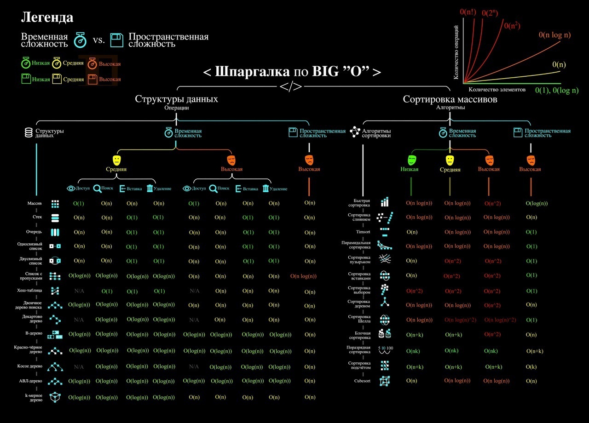
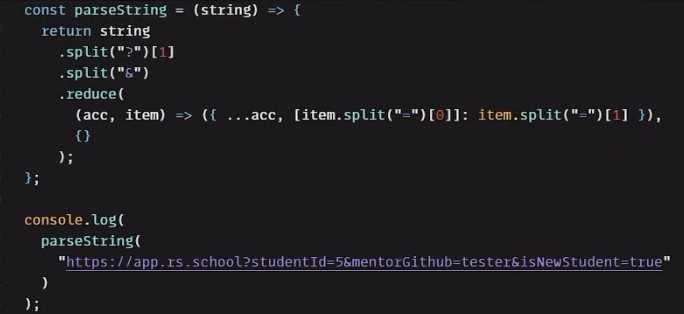

1. Алгоритм пузырьковой сортировки.

        const sortArray = (arr) => {
          let newArr = [...arr]
          for (let i = 0; i < newArr.length; i++) {
            for (let j = 0; j < newArr.length; j++) {
              if(newArr[i] < newArr[j]) {
                let cur = newArr[i]
                newArr[i] = newArr[j]
                newArr[j] = cur
              }      
            }    
          } console.log(newArr)
        }

        sortArray([4, 6, 5, 9, 1, 3, 7, 2, 8, 10])

2. Сложность алгоритмов
  
         

3. Задача

